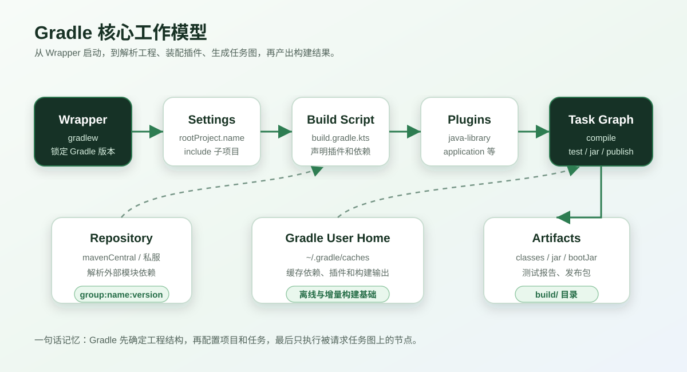
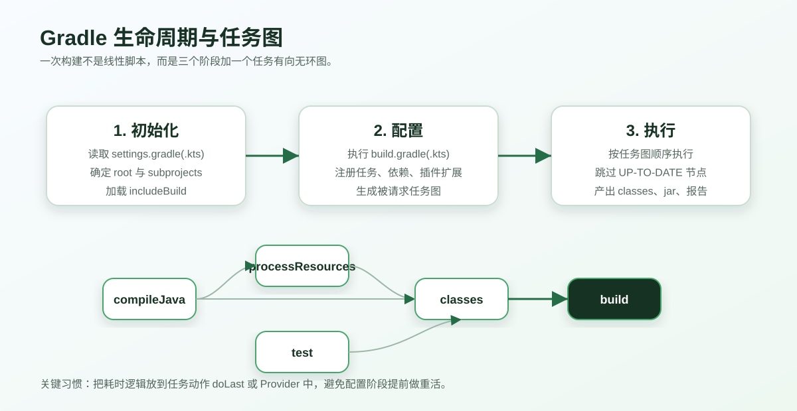
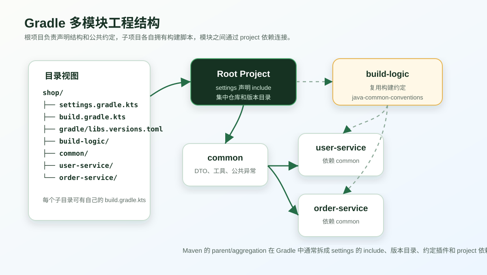

> 这篇文章按 Maven 学习笔记的学习路径来写，但不会把 Maven 的 XML 配置逐段翻译成 Gradle。更合适的方式是先建立 Gradle 自己的心智模型，再把 Maven 中熟悉的概念映射过去。

# Gradle 构建工具使用教程

Maven 文章里重点讲了依赖管理、构建生命周期、GAVP、IDEA 创建工程、依赖范围、依赖传递、继承聚合、私服和综合案例。Gradle 也解决这些问题，但它的表达方式不一样。

Maven 更像一套约定清晰的 XML 构建系统，生命周期固定、插件挂在阶段上执行。Gradle 更像一套可编程的构建平台，核心是 Project、Plugin、Task、Dependency、Configuration 和 Task Graph。它也有约定，但你可以用 Kotlin DSL 或 Groovy DSL 把构建逻辑写得更灵活。

本文以官方文档当前版本 Gradle 9.6.1 的概念为基准，示例优先使用 Kotlin DSL，也会在关键位置说明 Groovy DSL 写法差异。


## 一、Gradle 简介

### 1. 为什么学习 Gradle

#### 1.1 Gradle 是依赖管理工具

Java 项目只要引入 Spring Boot、MyBatis、Redis、消息队列、日志、测试框架，很快就会出现几十甚至上百个 jar 包。

如果手工管理这些 jar 包，会遇到几个老问题：

- jar 包从哪里下载
- jar 包版本如何统一
- 传递依赖冲突如何处理
- 编译期、运行期、测试期依赖如何分开
- 多个模块之间如何共享版本
- 私服、镜像仓库、内部组件如何接入

Gradle 和 Maven 一样，会从 Maven Central、公司 Nexus、Artifactory 等仓库下载依赖，也会解析传递依赖。不同的是，Gradle 用 `Configuration` 表达依赖用途，例如 `implementation`、`api`、`compileOnly`、`runtimeOnly`、`testImplementation`。

比如一个普通 Java 项目只需要这样声明依赖：

```kotlin
dependencies {
    implementation("com.google.guava:guava:33.3.1-jre")
    testImplementation("org.junit.jupiter:junit-jupiter:5.11.4")
}
```

如果是 Groovy DSL：

```groovy
dependencies {
    implementation 'com.google.guava:guava:33.3.1-jre'
    testImplementation 'org.junit.jupiter:junit-jupiter:5.11.4'
}
```

Gradle 会根据这些声明计算编译 classpath、运行 classpath、测试 classpath，并把依赖下载到本地缓存中。

#### 1.2 Gradle 是项目构建工具

所谓构建，不只是把代码编译一下。一个完整的 Java 项目通常要经过这些步骤：

1. 清理旧产物
2. 编译源码
3. 处理资源文件
4. 编译测试代码
5. 执行单元测试
6. 打包 jar 或 war
7. 生成测试报告、覆盖率报告
8. 发布到本地仓库或远程私服
9. 在 CI 中缓存依赖和构建产物

Maven 用固定生命周期串起这些步骤，例如 `clean`、`compile`、`test`、`package`、`install`、`deploy`。Gradle 则用任务图来表达：`build` 任务依赖 `check` 和 `assemble`，`assemble` 依赖 `jar`，`jar` 又依赖 `classes`，`classes` 依赖 `compileJava` 和 `processResources`。

所以在 Gradle 中，常用命令看起来是这样：

```bash
# macOS / Linux
./gradlew clean build

# Windows
gradlew.bat clean build
```

#### 1.3 Gradle 与 Maven 的核心区别

| 对比项 | Maven | Gradle |
| --- | --- | --- |
| 配置语言 | XML | Kotlin DSL 或 Groovy DSL |
| 构建模型 | 生命周期阶段 | 任务图 |
| 默认约定 | 很强 | 很强，但更容易扩展 |
| 依赖范围 | scope | configuration |
| 多模块 | parent + modules | root project + subprojects |
| 版本统一 | dependencyManagement | version catalog / platform / constraints |
| 插件机制 | 插件绑定生命周期阶段 | 插件注册扩展、任务和约定 |
| 性能优化 | 相对固定 | 增量构建、构建缓存、配置缓存、并行构建 |
| 迁移成本 | 学习 XML 和生命周期 | 学习 DSL、任务图和配置阶段 |

一句话概括：Maven 更像“按固定流程填表”，Gradle 更像“用代码描述一套可优化的构建系统”。

### 2. Gradle 核心模型

先看一张图：



Gradle 项目里最常见的几个文件和目录如下：

| 文件或目录 | 作用 |
| --- | --- |
| `settings.gradle.kts` | 声明根项目名、插件仓库、依赖仓库、子项目 |
| `build.gradle.kts` | 当前项目的构建脚本，声明插件、依赖、任务 |
| `gradle/wrapper/gradle-wrapper.properties` | 锁定 Wrapper 使用的 Gradle 版本 |
| `gradlew` / `gradlew.bat` | Gradle Wrapper 启动脚本 |
| `gradle/libs.versions.toml` | 版本目录，集中管理依赖和插件版本 |
| `build/` | 当前模块的构建产物目录 |
| `~/.gradle/` | 用户级缓存目录，存放依赖、插件、Wrapper、构建缓存 |

Gradle 的核心概念可以这样理解：

| 概念 | 解释 |
| --- | --- |
| Project | 一个构建单元，根项目和每个子项目都是 Project |
| Task | 一个可执行构建动作，例如 `compileJava`、`test`、`jar` |
| Plugin | 扩展构建能力，例如 `java-library` 会添加 Java 编译、测试、打包任务 |
| Dependency | 项目需要的外部库、内部模块或本地文件 |
| Repository | 依赖下载来源，例如 `mavenCentral()`、私服 |
| Configuration | 依赖用途集合，例如 `implementation`、`runtimeOnly` |
| SourceSet | 源码集合，例如 `main`、`test` |
| Wrapper | 固定项目使用的 Gradle 版本，避免不同机器版本不一致 |
| Toolchain | 指定编译、测试使用的 JDK 版本 |
| Build Cache | 复用历史构建输出，加快本地和 CI 构建 |

## 二、Gradle 安装和环境配置

### 1. 什么时候需要安装 Gradle

官方推荐运行项目时使用 Gradle Wrapper，也就是 `./gradlew` 或 `gradlew.bat`，而不是直接用系统安装的 `gradle`。

你真正需要安装 Gradle 的场景通常只有两个：

1. 从零创建一个新 Gradle 项目。
2. 给一个还没有 Wrapper 的项目生成 Wrapper 文件。

如果项目已经包含下面这些文件，就可以直接用 Wrapper：

```text
gradle/
  wrapper/
    gradle-wrapper.jar
    gradle-wrapper.properties
gradlew
gradlew.bat
```

### 2. Java 版本要求

Gradle 自身运行在 JVM 上。按照当前官方兼容矩阵，Gradle 9.6.1 需要使用 JVM 17 到 JVM 26 来执行 Gradle。注意这里说的是“运行 Gradle 的 JVM”，不等于你的业务代码只能写 Java 17。

如果项目需要编译 Java 8、Java 11、Java 17 或 Java 21，推荐用 Java Toolchains 指定：

```kotlin
java {
    toolchain {
        languageVersion = JavaLanguageVersion.of(17)
    }
}
```

这比只设置 `sourceCompatibility` 更稳，因为它明确告诉 Gradle 用哪类 JDK 工具链来编译和测试项目。

### 3. 安装方式

如果只是学习，可以任选一种安装方式。

Windows 上可以用 Scoop：

```powershell
scoop install gradle
```

macOS 上可以用 Homebrew：

```bash
brew install gradle
```

Linux / macOS 也可以用 SDKMAN：

```bash
sdk install gradle
```

安装后检查版本：

```bash
gradle --version
```

### 4. 配置环境变量

常见环境变量有三个：

| 变量 | 说明 |
| --- | --- |
| `JAVA_HOME` | JDK 安装目录 |
| `GRADLE_HOME` | 手动安装 Gradle 时的安装目录，Wrapper 项目通常不需要 |
| `GRADLE_USER_HOME` | Gradle 用户缓存目录，默认是 `~/.gradle` |

普通开发者最需要关心的是 `JAVA_HOME` 和 `GRADLE_USER_HOME`。

如果公司网络访问外部仓库慢，可以把 `GRADLE_USER_HOME` 放在磁盘空间更充足的位置：

```powershell
$env:GRADLE_USER_HOME = "D:\gradle-cache"
```

也可以在 CI 里缓存这个目录，减少每次拉依赖的时间。

### 5. Gradle Wrapper 配置

给项目生成 Wrapper：

```bash
gradle wrapper --gradle-version 9.6.1 --distribution-type bin
```

生成后会出现：

```text
gradle/wrapper/gradle-wrapper.jar
gradle/wrapper/gradle-wrapper.properties
gradlew
gradlew.bat
```

`gradle-wrapper.properties` 里最关键的是：

```properties
distributionUrl=https\://services.gradle.org/distributions/gradle-9.6.1-bin.zip
```

日常开发时建议只用：

```bash
./gradlew build
```

Windows：

```powershell
gradlew.bat build
```

Wrapper 的意义很简单：项目说用哪个 Gradle 版本，团队所有机器和 CI 就都用哪个版本。不要让“我本地 Gradle 8，你本地 Gradle 9”这种问题偷偷进入项目。

### 6. 国内镜像和私服配置

依赖仓库一般写在 `settings.gradle.kts` 中，推荐集中管理：

```kotlin
pluginManagement {
    repositories {
        gradlePluginPortal()
        mavenCentral()
        maven("https://maven.aliyun.com/repository/gradle-plugin")
    }
}

dependencyResolutionManagement {
    repositoriesMode.set(RepositoriesMode.FAIL_ON_PROJECT_REPOS)
    repositories {
        mavenCentral()
        maven("https://maven.aliyun.com/repository/public")
        maven {
            name = "companyNexus"
            url = uri("https://nexus.example.com/repository/maven-public/")
        }
    }
}
```

`pluginManagement` 管插件，`dependencyResolutionManagement` 管普通依赖。很多初学者把这两个仓库混在一起，结果插件找不到或依赖找不到，排查会很绕。

## 三、创建 Gradle 工程

### 1. 使用 gradle init 创建 Java 项目

创建一个 Java 应用：

```bash
gradle init \
  --type java-application \
  --dsl kotlin \
  --test-framework junit-jupiter \
  --package com.example.demo \
  --project-name gradle-demo \
  --java-version 17
```

Windows PowerShell 可以写成：

```powershell
gradle init `
  --type java-application `
  --dsl kotlin `
  --test-framework junit-jupiter `
  --package com.example.demo `
  --project-name gradle-demo `
  --java-version 17
```

如果当前目录存在 `pom.xml`，`gradle init` 还可以尝试把 Maven 项目转换成 Gradle 项目。这个转换适合作为起点，不建议认为它会百分百还原所有 Maven 插件行为。

### 2. 项目目录结构

一个普通 Java 应用大概长这样：

```text
gradle-demo/
├── app/
│   ├── build.gradle.kts
│   └── src/
│       ├── main/
│       │   ├── java/
│       │   └── resources/
│       └── test/
│           ├── java/
│           └── resources/
├── gradle/
│   ├── libs.versions.toml
│   └── wrapper/
├── settings.gradle.kts
├── gradlew
└── gradlew.bat
```

这和 Maven 的标准目录很像：

```text
src/main/java
src/main/resources
src/test/java
src/test/resources
```

区别在于 Gradle 经常会把根项目和应用模块分开。根目录负责工程结构、版本和公共配置，`app` 子项目负责真正的业务应用。

### 3. settings.gradle.kts

`settings.gradle.kts` 是 Gradle 很重要但容易被忽略的文件。它在初始化阶段执行，负责告诉 Gradle“这个构建里有哪些项目”。

```kotlin
pluginManagement {
    repositories {
        gradlePluginPortal()
        mavenCentral()
    }
}

dependencyResolutionManagement {
    repositoriesMode.set(RepositoriesMode.FAIL_ON_PROJECT_REPOS)
    repositories {
        mavenCentral()
    }
}

rootProject.name = "gradle-demo"
include("app")
```

多模块项目中，`include("app", "common", "user-service")` 就相当于声明这些子项目参与同一次构建。

### 4. build.gradle.kts

子项目的 `build.gradle.kts` 负责声明插件、依赖和任务配置：

```kotlin
plugins {
    application
}

java {
    toolchain {
        languageVersion = JavaLanguageVersion.of(17)
    }
}

application {
    mainClass = "com.example.demo.App"
}

dependencies {
    testImplementation(libs.junit.jupiter)
}

tasks.test {
    useJUnitPlatform()
}
```

如果不用版本目录，也可以直接写版本：

```kotlin
dependencies {
    testImplementation("org.junit.jupiter:junit-jupiter:5.11.4")
}
```

### 5. Kotlin DSL 和 Groovy DSL 怎么选

Gradle 支持两种主流 DSL：

| DSL | 文件 | 特点 |
| --- | --- | --- |
| Kotlin DSL | `build.gradle.kts` | 类型安全、IDE 补全好、适合新项目 |
| Groovy DSL | `build.gradle` | 历史更久、写法更短、老项目常见 |

新项目建议直接用 Kotlin DSL。它的代码提示、重构和编译期检查更舒服，团队长期维护成本更低。

同一个依赖配置，两种写法对比如下：

```kotlin
dependencies {
    implementation("org.apache.commons:commons-lang3:3.17.0")
}
```

```groovy
dependencies {
    implementation 'org.apache.commons:commons-lang3:3.17.0'
}
```

思路一样，只是语法不同。

## 四、在 IDEA 中使用 Gradle

### 1. 导入项目

在 IntelliJ IDEA 中打开 Gradle 项目时，建议遵循这几条：

- 直接打开包含 `settings.gradle.kts` 的根目录。
- Gradle JVM 选择项目要求的 JDK。
- Use Gradle from 选择 `gradle-wrapper.properties`。
- Build and run using 可以选择 Gradle，也可以按团队习惯选择 IntelliJ IDEA。
- 测试运行器如果要和 CI 完全一致，建议使用 Gradle。

如果你打开的是子模块目录，IDEA 可能识别不到完整的多模块结构。很多“依赖模块找不到”的问题，本质上只是打开目录不对。

### 2. 常用 Gradle 面板任务

IDEA Gradle 面板里常见任务：

| 任务 | 作用 |
| --- | --- |
| `clean` | 删除构建产物 |
| `classes` | 编译 main 源码和资源 |
| `test` | 执行测试 |
| `jar` | 打普通 jar |
| `assemble` | 组装产物，不一定跑测试 |
| `check` | 执行校验任务，通常包含测试 |
| `build` | 完整构建，通常包含 `assemble` 和 `check` |
| `bootRun` | Spring Boot 插件提供，启动应用 |
| `bootJar` | Spring Boot 插件提供，打可执行 jar |

### 3. IDEA 同步慢怎么办

同步慢通常不是 IDEA 一个锅，Gradle 配置也可能有问题。

优先检查：

- 构建脚本配置阶段是否做了网络请求、文件扫描、执行外部命令。
- 是否使用 `tasks.register`，而不是到处 `tasks.create`。
- 仓库是否走了不可用或很慢的外部地址。
- 是否把所有仓库都写在每个子项目里，导致重复解析。
- 是否启用了不兼容的插件版本。
- `JAVA_HOME`、Gradle JVM、toolchain 版本是否互相打架。

配置阶段越干净，IDEA 同步越快。

## 五、Gradle 构建生命周期

### 1. 三个阶段

Gradle 一次构建分为三个阶段：



| 阶段 | 做什么 |
| --- | --- |
| Initialization | 读取 settings，确定根项目、子项目、included builds |
| Configuration | 执行构建脚本，注册任务，计算被请求任务图 |
| Execution | 按任务图执行任务 |

举个例子：

```bash
./gradlew :app:build
```

Gradle 会先确定有哪些项目，然后配置 `:app` 以及它需要的项目，最后执行 `:app:build` 任务图上的节点。

### 2. Task 任务图

Gradle 的任务不是简单从上往下执行，而是通过依赖关系组成 DAG，也就是有向无环图。

比如 Java 插件添加的任务大概有这些关系：

```text
build
├── assemble
│   └── jar
│       └── classes
│           ├── compileJava
│           └── processResources
└── check
    └── test
        └── testClasses
            └── compileTestJava
```

所以你执行 `./gradlew build`，不代表 Gradle 只执行一个名叫 build 的动作，而是执行 build 所依赖的一串任务。

### 3. 常用命令

查看项目任务：

```bash
./gradlew tasks
```

查看某个任务帮助：

```bash
./gradlew help --task build
```

清理并构建：

```bash
./gradlew clean build
```

跳过测试：

```bash
./gradlew build -x test
```

只构建某个子项目：

```bash
./gradlew :app:build
```

继续执行后续任务，即使某个任务失败：

```bash
./gradlew build --continue
```

打印更多日志：

```bash
./gradlew build --info
```

打印异常栈：

```bash
./gradlew build --stacktrace
```

刷新依赖缓存：

```bash
./gradlew build --refresh-dependencies
```

开启并行构建：

```bash
./gradlew build --parallel
```

开启构建缓存：

```bash
./gradlew build --build-cache
```

### 4. 自定义任务

Kotlin DSL：

```kotlin
tasks.register("hello") {
    group = "demo"
    description = "打印一条构建问候"

    doLast {
        println("Hello Gradle")
    }
}
```

执行：

```bash
./gradlew hello
```

给任务声明依赖：

```kotlin
tasks.register("packageAndReport") {
    group = "build"
    dependsOn("build")

    doLast {
        println("构建完成，可以收集报告")
    }
}
```

配置已有任务：

```kotlin
tasks.test {
    useJUnitPlatform()
    testLogging {
        events("passed", "skipped", "failed")
    }
}
```

### 5. 配置阶段不要做重活

这是 Gradle 初学者很容易踩的坑。

不要这样写：

```kotlin
println("配置阶段就执行了")

val files = fileTree("src").files
println("配置阶段扫描了 ${files.size} 个文件")
```

更好的方式是把真正动作放到任务执行阶段：

```kotlin
tasks.register("countSourceFiles") {
    group = "verification"

    doLast {
        val files = fileTree("src").files
        println("源码文件数量：${files.size}")
    }
}
```

原因是 Gradle 每次同步或执行任何任务都要经过配置阶段。如果配置阶段做太多事情，IDEA 同步、命令行构建、CI 都会变慢。

## 六、Gradle 依赖管理

### 1. 仓库配置

最常用仓库：

```kotlin
repositories {
    mavenCentral()
}
```

Android 项目常见：

```kotlin
repositories {
    google()
    mavenCentral()
}
```

公司私服：

```kotlin
repositories {
    maven {
        name = "companyNexus"
        url = uri("https://nexus.example.com/repository/maven-public/")
    }
}
```

带账号密码：

```kotlin
repositories {
    maven {
        name = "companyRelease"
        url = uri("https://nexus.example.com/repository/maven-releases/")
        credentials {
            username = providers.gradleProperty("nexusUsername").orElse("").get()
            password = providers.gradleProperty("nexusPassword").orElse("").get()
        }
    }
}
```

账号密码不要写死在 Git 仓库里，可以放到用户目录的 `~/.gradle/gradle.properties`：

```properties
nexusUsername=your-name
nexusPassword=your-password
```

### 2. 依赖声明方式

最常见的模块依赖：

```kotlin
dependencies {
    implementation("org.apache.commons:commons-lang3:3.17.0")
}
```

项目依赖：

```kotlin
dependencies {
    implementation(project(":common"))
}
```

本地 jar 依赖：

```kotlin
dependencies {
    implementation(files("libs/legacy-sdk.jar"))
}
```

本地目录中所有 jar：

```kotlin
dependencies {
    implementation(fileTree("libs") {
        include("*.jar")
    })
}
```

本地 jar 只适合临时接入历史包。长期方案还是应该把包发布到 Maven 私服，保证 CI 和其他开发者都能稳定拉取。

### 3. Configuration 与 Maven scope 对照

| Maven scope | Gradle configuration | 说明 |
| --- | --- | --- |
| `compile` | `implementation` 或 `api` | 应用项目优先 `implementation`，库项目对外暴露才用 `api` |
| `provided` | `compileOnly` | 编译需要，运行环境提供 |
| `runtime` | `runtimeOnly` | 编译不需要，运行需要 |
| `test` | `testImplementation` / `testRuntimeOnly` | 测试编译或测试运行依赖 |
| `import` | `platform` / `enforcedPlatform` | 导入 BOM |
| `system` | 尽量避免 | 可用 `files()` 临时替代，但不推荐 |

`api` 和 `implementation` 是 Gradle Java Library 插件里最重要的区别。

假设 `order-service` 依赖 `common`，`common` 又依赖 `guava`：

```kotlin
// common/build.gradle.kts
plugins {
    `java-library`
}

dependencies {
    implementation("com.google.guava:guava:33.3.1-jre")
}
```

这表示 `guava` 是 `common` 内部实现细节。依赖 `common` 的模块不能直接在编译期使用 `guava` 类型。

如果 `common` 的公开 API 中暴露了 `guava` 类型，就应该写：

```kotlin
dependencies {
    api("com.google.guava:guava:33.3.1-jre")
}
```

简单规则：

- 应用项目：大多数依赖用 `implementation`。
- 库项目：只有出现在公开 API 中的依赖才用 `api`。
- Lombok 这类只在编译期用的依赖用 `compileOnly` 和 `annotationProcessor`。

### 4. 常见依赖配置示例

JUnit 5：

```kotlin
dependencies {
    testImplementation(platform("org.junit:junit-bom:5.11.4"))
    testImplementation("org.junit.jupiter:junit-jupiter")
}

tasks.test {
    useJUnitPlatform()
}
```

Lombok：

```kotlin
dependencies {
    compileOnly("org.projectlombok:lombok:1.18.36")
    annotationProcessor("org.projectlombok:lombok:1.18.36")

    testCompileOnly("org.projectlombok:lombok:1.18.36")
    testAnnotationProcessor("org.projectlombok:lombok:1.18.36")
}
```

Spring Boot 常见写法：

```kotlin
plugins {
    id("org.springframework.boot") version "3.5.0"
    id("io.spring.dependency-management") version "1.1.7"
    java
}

dependencies {
    implementation("org.springframework.boot:spring-boot-starter-web")
    implementation("org.springframework.boot:spring-boot-starter-validation")
    runtimeOnly("com.mysql:mysql-connector-j")
    testImplementation("org.springframework.boot:spring-boot-starter-test")
}

tasks.test {
    useJUnitPlatform()
}
```

这里的 Spring Boot 插件版本只是示例，实际项目应该和公司基础脚手架或 Spring Boot 官方当前稳定版本保持一致。

### 5. 排除传递依赖

排除某个传递依赖：

```kotlin
dependencies {
    implementation("org.springframework.boot:spring-boot-starter-web") {
        exclude(group = "org.springframework.boot", module = "spring-boot-starter-logging")
    }
}
```

全局排除：

```kotlin
configurations.all {
    exclude(group = "commons-logging", module = "commons-logging")
}
```

全局排除要谨慎。它影响整个项目，可能让某些模块在运行期缺类。

### 6. 解决版本冲突

查看依赖树：

```bash
./gradlew :app:dependencies --configuration runtimeClasspath
```

查看某个依赖为什么被引入：

```bash
./gradlew :app:dependencyInsight \
  --dependency guava \
  --configuration runtimeClasspath
```

添加约束：

```kotlin
dependencies {
    constraints {
        implementation("com.google.guava:guava:33.3.1-jre") {
            because("统一 Guava 版本，避免不同模块拉取多个版本")
        }
    }
}
```

严格版本：

```kotlin
dependencies {
    constraints {
        implementation("org.apache.commons:commons-compress") {
            version {
                strictly("1.27.1")
            }
            because("安全修复版本，不允许降级")
        }
    }
}
```

强制版本可以用，但不要滥用：

```kotlin
configurations.all {
    resolutionStrategy {
        force("com.google.guava:guava:33.3.1-jre")
    }
}
```

优先级建议：

1. 使用 BOM 或 platform 统一版本。
2. 使用 version catalog 集中版本。
3. 使用 constraints 写清约束原因。
4. 最后才考虑 `force`。

### 7. 使用 BOM

导入普通 BOM：

```kotlin
dependencies {
    implementation(platform("com.fasterxml.jackson:jackson-bom:2.18.2"))
    implementation("com.fasterxml.jackson.core:jackson-databind")
    implementation("com.fasterxml.jackson.datatype:jackson-datatype-jsr310")
}
```

使用 `enforcedPlatform` 会强制覆盖传递依赖版本：

```kotlin
dependencies {
    implementation(enforcedPlatform("com.fasterxml.jackson:jackson-bom:2.18.2"))
}
```

普通项目优先用 `platform`。`enforcedPlatform` 更强硬，适合公司平台包或安全治理场景。

### 8. 版本目录 libs.versions.toml

当依赖多起来后，不建议每个模块都散落版本号。可以用 `gradle/libs.versions.toml` 集中管理。

```toml
[versions]
junit = "5.11.4"
guava = "33.3.1-jre"
commonsLang3 = "3.17.0"

[libraries]
junit-bom = { module = "org.junit:junit-bom", version.ref = "junit" }
junit-jupiter = { module = "org.junit.jupiter:junit-jupiter" }
guava = { module = "com.google.guava:guava", version.ref = "guava" }
commons-lang3 = { module = "org.apache.commons:commons-lang3", version.ref = "commonsLang3" }

[plugins]
spring-boot = { id = "org.springframework.boot", version = "3.5.0" }
```

在构建脚本中使用：

```kotlin
dependencies {
    implementation(libs.guava)
    implementation(libs.commons.lang3)
    testImplementation(platform(libs.junit.bom))
    testImplementation(libs.junit.jupiter)
}
```

插件也可以使用：

```kotlin
plugins {
    alias(libs.plugins.spring.boot) apply false
}
```

版本目录的好处是：

- 依赖版本集中维护。
- IDE 有类型安全补全。
- 多模块共享同一套版本。
- 代码审查时更容易看出版本变更。

## 七、插件机制和常用插件

### 1. 插件是什么

Gradle 插件可以做很多事：

- 添加任务
- 添加扩展配置块
- 添加默认目录约定
- 添加依赖配置
- 修改打包产物
- 接入测试、发布、代码检查工具

比如应用 `java` 插件后，项目会自动拥有 `compileJava`、`processResources`、`classes`、`jar`、`test`、`build` 等任务。

### 2. plugins DSL

推荐使用 `plugins` 块：

```kotlin
plugins {
    java
    `java-library`
    application
    `maven-publish`
}
```

实际项目不会同时用这么多，按项目类型选择即可。

常见插件：

| 插件 | 用途 |
| --- | --- |
| `java` | Java 编译、测试、打包基础能力 |
| `java-library` | Java 库项目，支持 `api` 和 `implementation` 分离 |
| `application` | 命令行应用，支持 `run` 和发行包 |
| `war` | Web 项目打 war 包 |
| `maven-publish` | 发布到 Maven 本地仓库或远程仓库 |
| `jacoco` | 测试覆盖率 |
| `checkstyle` | 代码风格检查 |
| `org.springframework.boot` | Spring Boot 应用构建 |

### 3. application 插件

```kotlin
plugins {
    application
}

application {
    mainClass = "com.example.demo.App"
}
```

运行：

```bash
./gradlew run
```

打发行包：

```bash
./gradlew installDist
```

产物在：

```text
build/install/<project-name>/
```

### 4. java-library 插件

库项目建议用：

```kotlin
plugins {
    `java-library`
}
```

它比 `java` 多了 `api` 配置，能区分“对外 API 依赖”和“内部实现依赖”。

```kotlin
dependencies {
    api("org.slf4j:slf4j-api:2.0.16")
    implementation("com.fasterxml.jackson.core:jackson-databind:2.18.2")
}
```

这样依赖该库的模块能看到 `slf4j-api`，但不会在编译期直接看到 `jackson-databind`。

### 5. JaCoCo 覆盖率

```kotlin
plugins {
    jacoco
}

tasks.test {
    useJUnitPlatform()
    finalizedBy(tasks.jacocoTestReport)
}

tasks.jacocoTestReport {
    dependsOn(tasks.test)
    reports {
        xml.required.set(true)
        html.required.set(true)
    }
}
```

执行：

```bash
./gradlew test jacocoTestReport
```

报告位置：

```text
build/reports/jacoco/test/html/index.html
```

### 6. Convention Plugin 复用构建逻辑

多模块项目中，经常看到这种写法：

```kotlin
subprojects {
    apply(plugin = "java-library")

    repositories {
        mavenCentral()
    }
}
```

这能跑，但长期维护不一定优雅。更现代的做法是把公共约定封装成 convention plugin，放到 `build-logic` 或独立 included build 中。

例如：

```text
build-logic/
└── src/main/kotlin/
    └── java-common-conventions.gradle.kts
```

里面写公共配置：

```kotlin
plugins {
    `java-library`
}

java {
    toolchain {
        languageVersion = JavaLanguageVersion.of(17)
    }
}

tasks.test {
    useJUnitPlatform()
}
```

子项目使用：

```kotlin
plugins {
    id("java-common-conventions")
}
```

这样公共规则有名字、有边界，也更容易测试和演进。

## 八、多模块、继承和聚合

### 1. Maven 继承聚合到 Gradle 的映射

Maven 里常见：

- 父 POM 管统一版本和插件
- `<modules>` 聚合子模块
- 子模块通过 `<parent>` 继承配置

Gradle 中没有完全一样的 parent POM 概念，通常拆成几部分：

| Maven | Gradle |
| --- | --- |
| `<modules>` | `settings.gradle.kts` 里的 `include()` |
| `<parent>` | 根项目公共配置、convention plugin |
| `<dependencyManagement>` | `libs.versions.toml`、platform、constraints |
| `<pluginManagement>` | `pluginManagement` 或版本目录的 plugins |
| 模块间依赖 | `implementation(project(":common"))` |

看图更直观：



### 2. 多模块 settings

```kotlin
rootProject.name = "shop"

include(
    "common",
    "user-service",
    "order-service"
)
```

目录：

```text
shop/
├── settings.gradle.kts
├── build.gradle.kts
├── common/
│   └── build.gradle.kts
├── user-service/
│   └── build.gradle.kts
└── order-service/
    └── build.gradle.kts
```

### 3. 根项目 build.gradle.kts

根项目可以只放公共声明：

```kotlin
plugins {
    alias(libs.plugins.spring.boot) apply false
    id("io.spring.dependency-management") version "1.1.7" apply false
}

allprojects {
    group = "com.example.shop"
    version = "1.0.0-SNAPSHOT"
}
```

如果项目还不大，可以在根项目写少量公共配置。项目变大后，建议逐渐迁移到 convention plugin。

### 4. common 模块

```kotlin
plugins {
    `java-library`
}

java {
    toolchain {
        languageVersion = JavaLanguageVersion.of(17)
    }
}

dependencies {
    api("org.slf4j:slf4j-api:2.0.16")
    implementation("org.apache.commons:commons-lang3:3.17.0")
    testImplementation(platform("org.junit:junit-bom:5.11.4"))
    testImplementation("org.junit.jupiter:junit-jupiter")
}

tasks.test {
    useJUnitPlatform()
}
```

### 5. service 模块依赖 common

```kotlin
plugins {
    id("org.springframework.boot")
    id("io.spring.dependency-management")
    java
}

java {
    toolchain {
        languageVersion = JavaLanguageVersion.of(17)
    }
}

dependencies {
    implementation(project(":common"))
    implementation("org.springframework.boot:spring-boot-starter-web")
    testImplementation("org.springframework.boot:spring-boot-starter-test")
}

tasks.test {
    useJUnitPlatform()
}
```

构建单个服务：

```bash
./gradlew :user-service:build
```

构建所有模块：

```bash
./gradlew build
```

查看模块依赖：

```bash
./gradlew projects
```

### 6. 跨模块依赖的原则

建议遵守这些规则：

- 公共 DTO、异常、工具类放到 `common`。
- 领域能力不要都塞到 `common`，否则 common 会变成垃圾桶。
- 服务之间不要随意互相依赖，优先通过接口、RPC、消息或 API 契约解耦。
- 库模块用 `java-library`，应用模块用 `application` 或 Spring Boot 插件。
- 模块名和包名保持语义一致。

## 九、发布到 Maven 本地仓库和私服

### 1. 使用 maven-publish 插件

Gradle 发布 jar 到 Maven 仓库，需要 `maven-publish` 插件：

```kotlin
plugins {
    `java-library`
    `maven-publish`
}
```

配置发布：

```kotlin
publishing {
    publications {
        create<MavenPublication>("mavenJava") {
            from(components["java"])
            groupId = "com.example"
            artifactId = "common-lib"
            version = "1.0.0"
        }
    }
}
```

发布到本地 Maven 仓库：

```bash
./gradlew publishToMavenLocal
```

产物会进入：

```text
~/.m2/repository/com/example/common-lib/1.0.0/
```

### 2. 发布源码包和 Javadoc 包

```kotlin
java {
    withSourcesJar()
    withJavadocJar()
}
```

再执行：

```bash
./gradlew publishToMavenLocal
```

就会同时发布 sources jar 和 javadoc jar。

### 3. 发布到 Nexus 私服

```kotlin
publishing {
    publications {
        create<MavenPublication>("mavenJava") {
            from(components["java"])
        }
    }

    repositories {
        maven {
            name = "companyNexus"
            val releasesRepoUrl = uri("https://nexus.example.com/repository/maven-releases/")
            val snapshotsRepoUrl = uri("https://nexus.example.com/repository/maven-snapshots/")
            url = if (version.toString().endsWith("SNAPSHOT")) snapshotsRepoUrl else releasesRepoUrl

            credentials {
                username = providers.gradleProperty("nexusUsername").orElse("").get()
                password = providers.gradleProperty("nexusPassword").orElse("").get()
            }
        }
    }
}
```

发布：

```bash
./gradlew publish
```

如果只想本地验证生成的 POM：

```bash
./gradlew generatePomFileForMavenJavaPublication
```

生成路径一般在：

```text
build/publications/mavenJava/pom-default.xml
```

### 4. 版本号建议

常见版本约定：

```text
1.0.0-SNAPSHOT
1.0.0
1.1.0
2.0.0
```

建议：

- 开发分支用 `SNAPSHOT`。
- 发布正式包前移除 `SNAPSHOT`。
- CI 发布时由流水线注入版本号。
- 不要在多人共享分支里频繁覆盖同一个 release 版本。

## 十、性能优化和构建稳定性

### 1. Gradle Daemon

Gradle Daemon 是常驻后台进程，可以复用 JVM 和构建环境，减少启动开销。通常默认启用。

查看 Daemon：

```bash
./gradlew --status
```

停止 Daemon：

```bash
./gradlew --stop
```

如果遇到奇怪的缓存或进程问题，可以先 stop 再重试。

### 2. 增量构建

Gradle 会根据任务输入输出判断是否需要重新执行。常见状态：

| 状态 | 含义 |
| --- | --- |
| `UP-TO-DATE` | 输入输出没变，任务跳过 |
| `FROM-CACHE` | 从构建缓存恢复输出 |
| `NO-SOURCE` | 没有源文件 |
| `SKIPPED` | 条件不满足或被跳过 |

如果一个任务每次都重新执行，优先检查：

- 是否声明了输入输出。
- 是否每次生成不同内容，例如时间戳。
- 是否读取了没有声明的文件。
- 是否在任务中访问不稳定环境变量。

### 3. Build Cache

临时开启：

```bash
./gradlew build --build-cache
```

长期开启，在 `gradle.properties` 写：

```properties
org.gradle.caching=true
```

本地缓存配置：

```kotlin
buildCache {
    local {
        isEnabled = true
        removeUnusedEntriesAfterDays = 30
    }
}
```

远程缓存适合 CI 和大型团队，但要保证任务可缓存、输入输出准确，否则可能复用错误产物。

### 4. Configuration Cache

配置缓存可以缓存配置阶段结果，让后续构建跳过大量配置工作。

临时开启：

```bash
./gradlew build --configuration-cache
```

长期开启：

```properties
org.gradle.configuration-cache=true
```

如果插件或自定义任务不兼容，Gradle 会给出报告。不要为了开缓存忽略报告，应该修正不兼容的构建逻辑。

### 5. 并行构建

多模块项目可以开启并行：

```properties
org.gradle.parallel=true
```

或者命令行：

```bash
./gradlew build --parallel
```

并行不是越多越好。如果项目里有共享目录写入、生成代码互相覆盖、测试依赖外部端口，就可能暴露隐藏问题。

### 6. 常用 gradle.properties

```properties
org.gradle.jvmargs=-Xmx2g -Dfile.encoding=UTF-8
org.gradle.daemon=true
org.gradle.parallel=true
org.gradle.caching=true
org.gradle.configuration-cache=true
```

如果项目刚迁移，不建议一次性全开。可以先保证构建正确，再逐项开启性能选项。

## 十一、常见问题排查

### 1. Plugin was not found

典型报错：

```text
Plugin [id: 'org.springframework.boot', version: 'x.y.z'] was not found
```

排查：

- `settings.gradle.kts` 中是否配置了 `pluginManagement.repositories`。
- 是否能访问 `gradlePluginPortal()`。
- 公司网络是否需要代理或私服镜像。
- 插件 id 和版本是否写错。

### 2. Could not resolve dependencies

依赖解析失败通常看这几处：

- 仓库地址是否配置。
- 私服账号密码是否正确。
- 依赖坐标是否写错。
- 版本是否存在。
- 本地缓存是否损坏。

刷新依赖：

```bash
./gradlew build --refresh-dependencies
```

离线模式检查：

```bash
./gradlew build --offline
```

### 3. Unsupported class file major version

这类错误通常是 JDK 版本不匹配。

排查：

```bash
./gradlew --version
java -version
```

再检查：

- Gradle JVM 是不是太旧。
- 项目 toolchain 是不是和依赖要求不一致。
- 某个插件是否不支持当前 JDK。
- CI 的 JDK 是否和本地不同。

### 4. No tests found

JUnit 5 项目别忘了：

```kotlin
tasks.test {
    useJUnitPlatform()
}
```

测试类命名也要符合扫描规则，例如：

```text
UserServiceTest
UserServiceTests
UserServiceSpec
```

### 5. 找不到子项目

如果执行：

```bash
./gradlew :user-service:build
```

报找不到项目，检查 `settings.gradle.kts`：

```kotlin
include("user-service")
```

如果实际目录是 `services/user-service`，可以这样：

```kotlin
include("user-service")
project(":user-service").projectDir = file("services/user-service")
```

或者直接用嵌套路径：

```kotlin
include("services:user-service")
```

对应任务路径就是：

```bash
./gradlew :services:user-service:build
```

### 6. 依赖版本不是我声明的版本

用 `dependencyInsight`：

```bash
./gradlew :app:dependencyInsight \
  --dependency jackson-databind \
  --configuration runtimeClasspath
```

重点看：

- 谁引入了它。
- 哪个版本最终胜出。
- 是否被 BOM、constraint、force、plugin 管理。

### 7. 构建脚本里中文乱码

建议在 `gradle.properties` 中加：

```properties
org.gradle.jvmargs=-Dfile.encoding=UTF-8
```

Windows 终端必要时也设置 UTF-8：

```powershell
[Console]::OutputEncoding = [System.Text.Encoding]::UTF8
```

## 十二、Maven 项目迁移到 Gradle

### 1. 自动转换

在 Maven 项目根目录执行：

```bash
gradle init
```

Gradle 会读取 `pom.xml`，生成对应的 Gradle 构建脚本和 settings 文件。多模块 Maven 项目也会尝试转换。

但要注意：自动转换只是起点，尤其是这些内容需要人工复核：

- Maven 插件的自定义执行逻辑。
- assembly、shade、docker、frontend 等复杂打包步骤。
- profile 激活条件。
- resource filtering。
- exclusions 的语义差异。
- 私服、镜像和认证配置。
- 父 POM 中的 pluginManagement。

### 2. 迁移顺序建议

不要一上来就全项目重写。更稳的顺序是：

1. 保留 Maven，先跑通原始测试和打包命令，记录基线。
2. 用 `gradle init` 生成初稿。
3. 对齐 group、name、version。
4. 对齐 repositories 和依赖版本。
5. 跑 `./gradlew test`，先保证测试一致。
6. 跑 `./gradlew build`，保证产物一致。
7. 对齐发布逻辑。
8. 再优化 version catalog、多模块约定插件、缓存和 CI。

### 3. POM 到 Gradle 的常见翻译

Maven：

```xml
<dependency>
    <groupId>org.apache.commons</groupId>
    <artifactId>commons-lang3</artifactId>
    <version>3.17.0</version>
</dependency>
```

Gradle：

```kotlin
dependencies {
    implementation("org.apache.commons:commons-lang3:3.17.0")
}
```

Maven 排除：

```xml
<exclusions>
    <exclusion>
        <groupId>commons-logging</groupId>
        <artifactId>commons-logging</artifactId>
    </exclusion>
</exclusions>
```

Gradle 排除：

```kotlin
implementation("some.group:some-artifact:1.0.0") {
    exclude(group = "commons-logging", module = "commons-logging")
}
```

Maven 模块：

```xml
<modules>
    <module>common</module>
    <module>user-service</module>
</modules>
```

Gradle：

```kotlin
include("common", "user-service")
```

Maven 父 POM 中统一版本，Gradle 推荐迁移成：

```toml
[versions]
commonsLang3 = "3.17.0"

[libraries]
commons-lang3 = { module = "org.apache.commons:commons-lang3", version.ref = "commonsLang3" }
```

### 4. 不要照搬 Maven 思维

迁移时最容易犯的错是“用 Gradle 写 Maven”。

比如：

- 过度依赖根项目 `subprojects` 大闭包。
- 所有依赖都写 `api`。
- 用 `task doSomething` 模拟 Maven phase。
- 不区分配置阶段和执行阶段。
- 版本号散落在每个模块。
- 直接用本地 jar 替代私服。

Gradle 的优势不在于少写几行 XML，而在于任务图、增量构建、可复用构建逻辑和依赖可见性控制。

## 十三、综合案例：多模块 Spring Boot 项目

假设我们要搭建一个简单商城项目：

```text
shop/
├── settings.gradle.kts
├── build.gradle.kts
├── gradle/
│   └── libs.versions.toml
├── common/
│   ├── build.gradle.kts
│   └── src/main/java/com/example/shop/common/
├── user-service/
│   ├── build.gradle.kts
│   └── src/main/java/com/example/shop/user/
└── order-service/
    ├── build.gradle.kts
    └── src/main/java/com/example/shop/order/
```

### 1. settings.gradle.kts

```kotlin
pluginManagement {
    repositories {
        gradlePluginPortal()
        mavenCentral()
    }
}

dependencyResolutionManagement {
    repositoriesMode.set(RepositoriesMode.FAIL_ON_PROJECT_REPOS)
    repositories {
        mavenCentral()
    }
}

rootProject.name = "shop"

include(
    "common",
    "user-service",
    "order-service"
)
```

### 2. gradle/libs.versions.toml

```toml
[versions]
java = "17"
springBoot = "3.5.0"
springDependencyManagement = "1.1.7"
junit = "5.11.4"
commonsLang3 = "3.17.0"

[libraries]
commons-lang3 = { module = "org.apache.commons:commons-lang3", version.ref = "commonsLang3" }
junit-bom = { module = "org.junit:junit-bom", version.ref = "junit" }
junit-jupiter = { module = "org.junit.jupiter:junit-jupiter" }

[plugins]
spring-boot = { id = "org.springframework.boot", version.ref = "springBoot" }
spring-dependency-management = { id = "io.spring.dependency-management", version.ref = "springDependencyManagement" }
```

### 3. 根项目 build.gradle.kts

```kotlin
plugins {
    alias(libs.plugins.spring.boot) apply false
    alias(libs.plugins.spring.dependency.management) apply false
}

allprojects {
    group = "com.example.shop"
    version = "1.0.0-SNAPSHOT"
}
```

### 4. common/build.gradle.kts

```kotlin
plugins {
    `java-library`
}

java {
    toolchain {
        languageVersion = JavaLanguageVersion.of(libs.versions.java.get())
    }
}

dependencies {
    api("org.slf4j:slf4j-api:2.0.16")
    implementation(libs.commons.lang3)
    testImplementation(platform(libs.junit.bom))
    testImplementation(libs.junit.jupiter)
}

tasks.test {
    useJUnitPlatform()
}
```

如果 `JavaLanguageVersion.of(libs.versions.java.get())` 在你的 Gradle 版本或写法下类型不匹配，可以改成更直白的：

```kotlin
languageVersion = JavaLanguageVersion.of(17)
```

### 5. user-service/build.gradle.kts

```kotlin
plugins {
    alias(libs.plugins.spring.boot)
    alias(libs.plugins.spring.dependency.management)
    java
}

java {
    toolchain {
        languageVersion = JavaLanguageVersion.of(17)
    }
}

dependencies {
    implementation(project(":common"))
    implementation("org.springframework.boot:spring-boot-starter-web")
    implementation("org.springframework.boot:spring-boot-starter-validation")
    testImplementation("org.springframework.boot:spring-boot-starter-test")
}

tasks.test {
    useJUnitPlatform()
}
```

### 6. order-service/build.gradle.kts

```kotlin
plugins {
    alias(libs.plugins.spring.boot)
    alias(libs.plugins.spring.dependency.management)
    java
}

java {
    toolchain {
        languageVersion = JavaLanguageVersion.of(17)
    }
}

dependencies {
    implementation(project(":common"))
    implementation("org.springframework.boot:spring-boot-starter-web")
    testImplementation("org.springframework.boot:spring-boot-starter-test")
}

tasks.test {
    useJUnitPlatform()
}
```

### 7. 常用命令

查看项目结构：

```bash
./gradlew projects
```

构建所有模块：

```bash
./gradlew clean build
```

只构建用户服务：

```bash
./gradlew :user-service:build
```

启动用户服务：

```bash
./gradlew :user-service:bootRun
```

打可执行 jar：

```bash
./gradlew :user-service:bootJar
```

查看用户服务运行期依赖：

```bash
./gradlew :user-service:dependencies --configuration runtimeClasspath
```

定位某个依赖来源：

```bash
./gradlew :user-service:dependencyInsight \
  --dependency commons-lang3 \
  --configuration runtimeClasspath
```

### 8. CI 示例

GitHub Actions 可以这样写：

```yaml
name: build

on:
  push:
  pull_request:

jobs:
  build:
    runs-on: ubuntu-latest

    steps:
      - uses: actions/checkout@v4

      - uses: actions/setup-java@v4
        with:
          distribution: temurin
          java-version: 17

      - uses: gradle/actions/setup-gradle@v4

      - run: ./gradlew clean build --build-cache
```

CI 中不要直接依赖本机已经安装的 Gradle，继续使用 Wrapper。

## 十四、实战建议清单

如果你从 Maven 切到 Gradle，可以按下面这份清单建立习惯。

工程结构：

- 根目录保留 `settings.gradle.kts`、Wrapper 和版本目录。
- 新项目优先 Kotlin DSL。
- 多模块通过 `include()` 管结构。
- 公共构建逻辑逐步沉淀到 convention plugin。

依赖管理：

- 应用项目默认用 `implementation`。
- Java 库项目使用 `java-library`，谨慎暴露 `api`。
- 测试依赖用 `testImplementation`。
- 编译期工具用 `compileOnly` 和 `annotationProcessor`。
- 版本集中到 `libs.versions.toml`。
- 公司组件发布到私服，不要长期提交本地 jar。

构建命令：

- 日常使用 `./gradlew build`。
- 子项目用 `:module:task`。
- 排查依赖用 `dependencies` 和 `dependencyInsight`。
- 排查异常用 `--stacktrace`、`--info`。
- 临时刷新依赖用 `--refresh-dependencies`。

性能优化：

- 避免配置阶段做重活。
- 自定义任务声明输入输出。
- 多模块开启 parallel 前先保证任务互不干扰。
- build cache 和 configuration cache 逐步开启。
- CI 缓存 Gradle User Home。

发布治理：

- 用 `maven-publish`。
- 账号密码放到环境变量或用户级 `gradle.properties`。
- release 和 snapshot 仓库分开。
- 发布前检查生成的 POM。
- 版本号由 CI 管理更稳。

## 十五、参考资料

- [Gradle User Manual](https://docs.gradle.org/current/userguide/userguide.html)
- [Gradle Wrapper](https://docs.gradle.org/current/userguide/gradle_wrapper.html)
- [Gradle Build Lifecycle](https://docs.gradle.org/current/userguide/build_lifecycle.html)
- [Declaring Dependencies](https://docs.gradle.org/current/userguide/declaring_dependencies_basics.html)
- [Dependency Configurations](https://docs.gradle.org/current/userguide/dependency_configurations.html)
- [Version Catalogs](https://docs.gradle.org/current/userguide/version_catalogs.html)
- [Multi-Project Builds](https://docs.gradle.org/current/userguide/multi_project_builds.html)
- [The Maven Publish Plugin](https://docs.gradle.org/current/userguide/publishing_maven.html)
- [Migrating Builds From Apache Maven](https://docs.gradle.org/current/userguide/migrating_from_maven.html)

## 总结

Maven 的学习重点是生命周期、坐标、依赖范围、继承聚合和私服。Gradle 的学习重点则是 Wrapper、settings、build script、插件、Configuration、Task Graph、版本目录、多模块和缓存。

刚开始学 Gradle，不要急着写复杂脚本。先掌握这条主线：

```text
Wrapper 固定版本
settings 声明工程结构
plugins 添加构建能力
dependencies 声明依赖用途
tasks 组成任务图
build 产出可测试、可发布的结果
```

理解这条线之后，Gradle 就不再是一堆陌生 DSL，而是一套能把项目依赖、构建、测试、发布和 CI 串起来的工程化工具。
