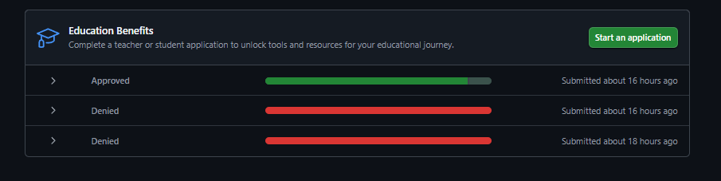
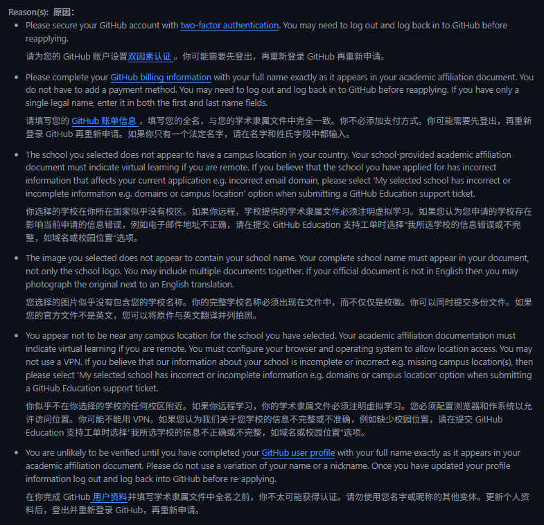
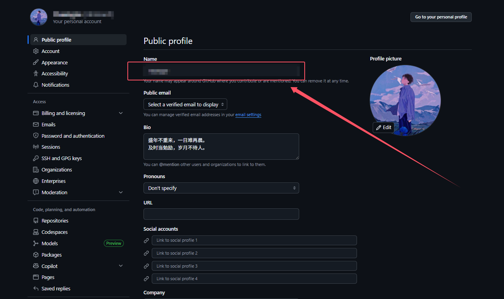
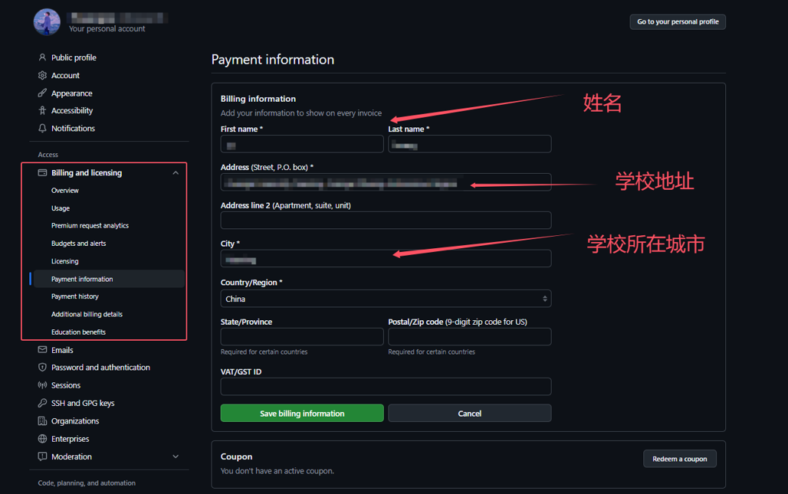
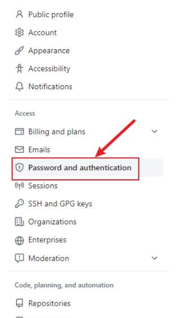
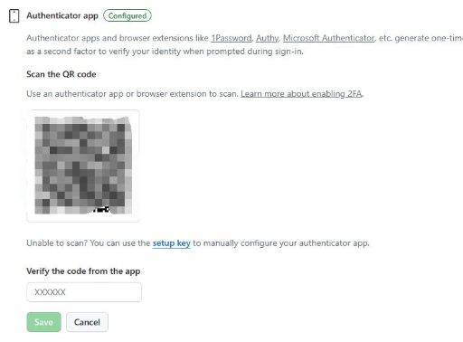
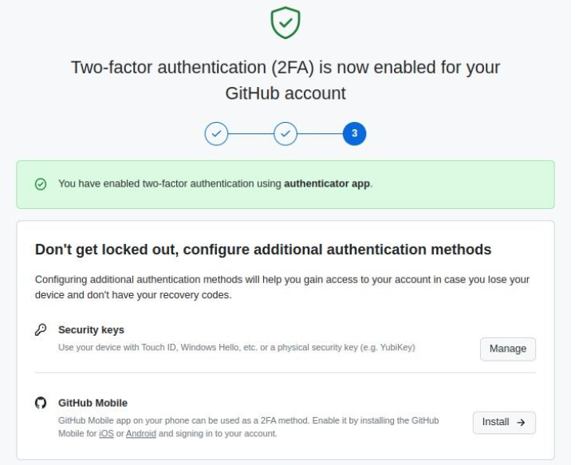
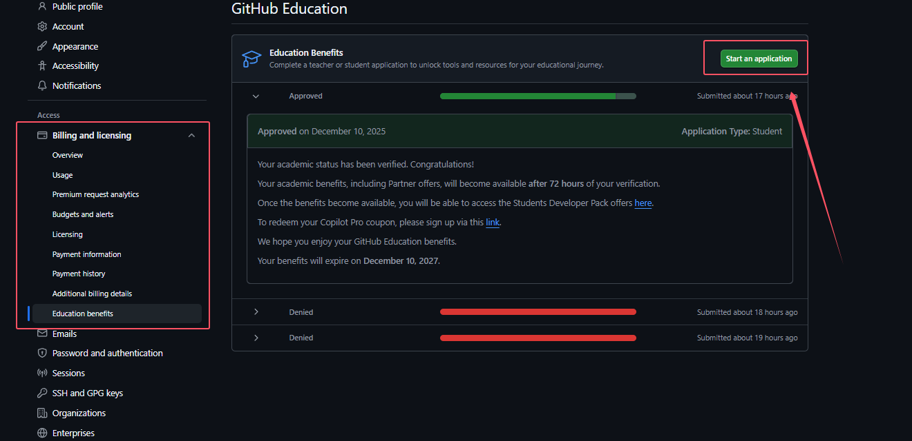
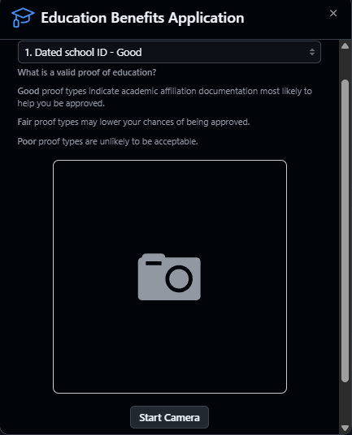
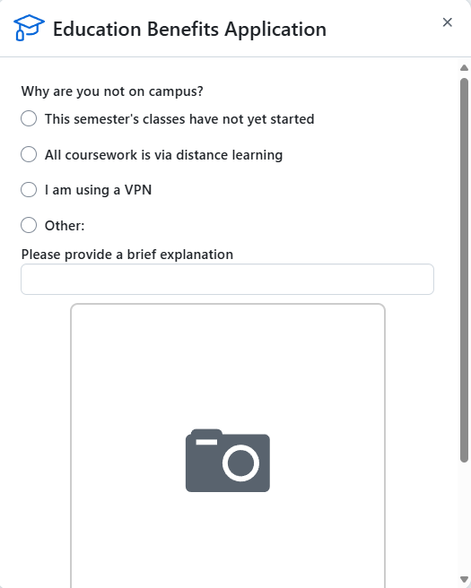

# **GitHub学生包申请教程**

> <strong style="color:   #2E8B57;font-size:16px">该教程针对的是有学生邮箱的群体（听说不用学生邮箱也能过，但是我没试过）</strong>



为什么要申请GitHub学生包？**申请Github学生认证的好处：**

- Github会员：尤其是**Github Copilot的免费使用权**。
- 专业的桌面IDE：**IntelliJ IDEA，PyCharm**等。学生的免费订阅，每年更新一次。
- GitHub学生的**免费AWS Educate入门帐户**，价值100美元。
- **Bootstrap Studio**是一款功能强大的桌面应用程序，用于使用Bootstrap框架创建响应式网站。当您是学生时，Bootstrap Studio可获得免费许可证。
- 使用**Canva**，任何人都可以创建外观专业的图形和设计。具有数千个模板和易于使用的编辑器。Canva Pro级别的12个月免费订阅。

**教程中所有步骤都是必要的操作，全部完成才能申请成功，否则：**



>所以还是跟着我的步骤一步一步走吧，如果已经完成，可以跳过一些步骤。
>
><strong style="color: orange;font-size:16px">接下来，跟随我的脚本，一步步完成申请吧~~</strong>

## 准备工作


1. 电脑下载[FastGithub](https://gitee.com/XingYuan55/FastGithub/releases)，用这个软件代替我们的代理。这个软件可以加速我们访问GitHub，同时不会改变我们的定位地址。
2. 电脑和手机都下载[IRIUN Webcam](https://iriun.net/#download)，这个软件可以让电脑使用手机的摄像头（后面需要拍照学生信息，电脑可能拍不清晰。如果你电脑摄像头拍照清晰，可以不用下载）。【**使用方法：电脑手机保持在同一局域网下，或usb链接**】
3. 手机下载Authenticator（Google play中下）或者其他的2FA软件都行。2FA 是指两步验证Two-Factor Authentication的缩写，平常的输入密码之后，还要短信验证码，这就是一种2FA 两步验证。**下这个是因为GitHub要求一定要开启两步验证，否则无法通过申请**

## 修改个人信息

> GitHub学生包要求个人信息要和申请时填写的信息一致，所有我们要把所有信息都改成实名

1. 首先是个人姓名（**填拼音**）

   

2. Payment information实名（**英文填写**）

   

3. 开启两步验证，打开Github主页，点击头像选择settings，点击Password and authentication

   

   点击Enable two-factor authentication按钮进入 2FA 配置页面，使用准备工作中下载的2FA软件扫一扫出现的二维码，软件上会出现六位数字，填入方框中，点击Save即可

   

   最后，点击I have saved my recovery codes按钮，一切顺利将出现如下页面，说明 2FA 已经配置成功。下次登录 GitHub 的时候，就会要求进行 2FA 验证才能登录成功。

   

> <strong style="color: orange;font-size:16px">上面的东西弄完后，重要：退出GitHub登录，重新登录！</strong>

## 开始认证

> 重要的事情说三遍：认证过程不能使用代理！认证过程不能使用代理！认证过程不能使用代理！

打开前面安装的1，2软件。

**接下来的操作建议使用edge浏览器，比较好通过Location shared**，然后进入Settings界面，然后打开Billing and licensing，Education benefits。



接下来就是正常填写信息就好。



然后下面是拍照步骤，打开[IRIUN Webcam](https://iriun.net/#download)后，电脑会使用手机的摄像头进行拍照。创建一个txt文件，写入以下信息(**全部用英文**)，然后在电脑屏幕上放大写的文本文档，用手机拍，电脑点拍照。注意拍完整。

```txt
Student Verification Report
Name:                       
School:                    
Student ID:                
Study Form: Full-time
Validate Until:07/2027
```

然后下一步，一般就没问题了。

## 补充问题

**补充：如果本人不在校内或学校附近或定位问题，导致出现出现这个界面**

> 把上面的Study Form: Full-time改成Study Form: Distance learning.然后重新申请



**选择第二项**：`All coursework is via distance learning`，然后拍照同样的手法，创建一个txt文件，写入以下信息(**全部用英文**)，然后在电脑屏幕上放大写的文本文档，用手机拍，电脑点拍照。

```
Student xxx（姓名和前面一致）,is allowed to study via distance learning in xxx（学校英文名，和前面一致）
```

> <strong style="color: orange;font-size:20px">然后基本上就通过了。可以等一分钟的样子，然后刷新，发现`Approved`，那就成功了。等三天人工验证，差不多就可以白嫖copilot了。</strong>

## 参考链接

https://zhaojianjun2004.github.io/2025/09/16/github_student/

https://zhuanlan.zhihu.com/p/1908643143429129800

https://www.bilibili.com/video/BV14xaEzcEU2/?spm_id_from=333.1007.top_right_bar_window_history.content.click&vd_source=bb322d85b33236267dc3acb6b5088cf9

https://www.bilibili.com/video/BV1JrrmY1E4W/?spm_id_from=333.1007.top_right_bar_window_history.content.click&vd_source=bb322d85b33236267dc3acb6b5088cf9
