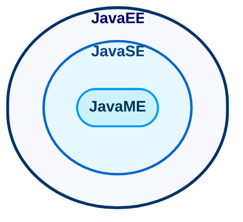

# 1. Java介绍

## 1.1 Java诞生

- **1990 sun公司 启动绿色计划**
- **1992 创建oak（橡树）语言 -> Java**
- **1994 gosling 参加硅谷大会 演示Java功能，震惊世界。**
- **1995sun 正式发布Java第一个版本。**
- **2009年，甲骨文公司宣布收购Sun.2011年，发布Java7**

## 1.2 Java技术体系平台

1. <strong>Java SE(Java Standard Edition)标准版</strong>：支持面向桌面级应用（如Windows下的应用程序）的Java平台，提供完整的Java核心API，此版本以前称为J2SE
2. <strong>Java EE(Java Enterprise Edition)企业版</strong>：是为开发企业环境下的应用程序提供的一套解决方案。该技术体系中包含的技术如：Servlet、Jsp等，主要针对于Web应用程序开发。版本以前称为J2EE
3. <strong>Java ME(Java Micro Edition)小型版</strong>：支持Java程序运行在移动终端（手机、PDA）上的平台，对所有Java API有所精简，并加入了针对移动终端的支持，此版本以前称为J2ME

> 简单来说，Java SE就是标准版，包含标准的JVM和标准库，而Java EE是企业版，它只是在Java SE的基础上加上了大量的API和库，以便方便开发Web应用、数据库、消息服务等，Java EE的应用使用的虚拟机和Java SE完全相同。Java ME就和Java SE不同，它是一个针对嵌入式设备的“瘦身版”，Java SE的标准库无法在Java ME上使用，Java ME的虚拟机也是“瘦身版”。

## 1.3 Java 重要特性

1. Java语言是面向对象的（oop）
2. Java语言是健壮的。Java的强类型机制、异常处理、垃圾的自动收集等是Java程序健壮性的重要保证。
3. Java语言是**跨平台性**的。『即：一个编译好的.class文件可以在多个系统下运行』

4. Java语言是解释型的

   > 解释型语言：javascript，PHP，Java   编译型的语言：C/C++
   >
   > 区别是：解释型语言，编译后的代码，不能直接被机器执行，需要解释器来执行；编译型的语言，编译后的代码可以直接被机器执行

##  1.4 JVM『Java virtual machine』介绍

1. JVM是一个虚拟的计算机，具有指令集并使用不同的存储区域。负责执行指令，管理数据、内存、寄存器。JVM包含在JDK中
2. 对于不同平台，有不同的虚拟机
3. Java虚拟机机制屏蔽了底层运行平台的差别，实现了“一次编译，到处运行”。当然，这是针对Java开发者而言。对于虚拟机，需要为每个平台分别开发。

## 1.5 JDK，JRE介绍

### 1.5.1 JDK（Java Development Kit）

1. JDK全称是Java Development Kit，Java开发工具包，**提供给Java程序开发人员使用**。

> JDK = JRE +Java开发工具 【Java。Javac，Javadoc，Javap等等】

### 1.5.2 JRE（Java Runtime Environment）

1. JRE（Java Runtime environment）Java运行环境，**为Java程序的运行提供支持**

> JRE = JVM + Java核心类库[类]
>
> **若只想运行Java程序，安装JRE即可**

## 1.6 Java一些细节说明

>1. Java源代码以.java为扩展名。源文件的基本组成部分都是类class
>2. Java应用程序的执行入口是main()方法。它有固定的书写格式：
>     public static void main(String[] args){ //...  }
>3. Java语言严格区分大小写
>4. Java方法由一条条语句构成，每个语句以“;”结束
>5. 大括号都是成对出现的，缺一不可。
>6. **一个源文件中最多只能有一个public类。其他类不限个数**
>7. 如果源文件包含一个public类，则文件名一定要与类名相同
>8. 可以将main方法写在非public类中，然后指定运行非public类，这样入口方法就是非public的main方法
>     **在一个.java文件里，编写两个类，执行javac编译命令后，会生成两个.class文件,通过java指令可以指定运行的.class文件**

## 1.7 Java中的注释类型

- 单行注释，使用 //
- 多行注释，使用 /*  */
- 文档注释，使用/** */
>**其中单行注释和多行注释一般是给程序维护者看的**
>
>**类和方法，建议使用文档注释（javadoc）**
