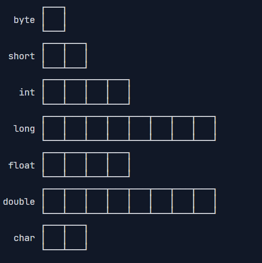

## 运行一个Java程序

1. 打开一个编辑器，编写代码：

```java
public class Hello {
    public static void main(String[] args){
    	System.out.println("Hello World!");    
    }
}
```

**其中class后面的Hello称为类名。public，static用来修饰main方法，表示main方法是公开的静态的。String[]是参数类型，args是参数名。void表示的是方法的返回值类型。**

2. 保存文件，文件名为Hello.java，文件名要与类名(Hello)相同。
3. 打开编辑，使用指令`Javac Hello.java`编译源码。编译完成后，会得到相应的字节码文件Hello.class。
4. 使用指令`Java Hello`(**注意并不是java Hello.class**)，运行字节码文件，打印输出Hello World!。

> Java11后，也支持直接使用```java Hello.java```运行源码。
>
> **但是，在实际项目中，单个不依赖第三方库的Java源码是非常罕见的，所以，绝大多数情况下，我们无法直接运行一个Java源码文件，原因是它需要依赖其他的库。**

## Java程序的基本结构

```java
/**
 * 可以用来自动创建文档的注释
 */
public class Hello {
    public static void main(String[] args) {
        // 向屏幕输出文本:
        System.out.println("Hello, world!");
        /* 多行注释开始
        注释内容
        注释结束 */
    }
} // class定义结束
```

java是面向对象的语言，所以程序的基本单位是class，class是关键字，用来定义一个类，这里定义了一个名为Hello的类。

```java
public class Hello { // 类名是Hello
    // ...
} // class定义结束
```

**命名规范：只能使用字母、数字、下划线进行命名，其中类名首字母一般大写，方法名首字母一般小写。**

## 变量

Java中定义变量的示例：

```Java
int a = 1;// int是变量类型（整型）,a 是变量名，=1 表示将1赋值给变量a。
int b;//如果不赋值，那么变量b的默认值为0
a = 2;//变量可以重复赋值
int c = a;//也可以使用变量给变量赋值
```

## 基本数据类型

Java中的基本数据类型有：

- 整数类型：byte、short、int、long
- 浮点数类型：float、double
- 字符类型：char
- 布尔类型：boolean

不同数据类型占用的字节数不一样。**byte占一个字节，short占两个字节，int占四个字节，long占8个字节；float占4个字节，double占8个字节；char占两个字节。**



【**后面再具体介绍**】：不同类型的变量相互赋值时，会触发自动类型转换的方向为：byte->short->int->long->float->double；char->byte->short。特殊情况：byte, short, char 在运算时，会先自动提升为 int。

> 扩展内容：计算机最小存储单元为一个字节（byte），一个字节等于8位（bit）二进制数。其中最高位的bit位表示符号位（0表示正数，1表示负数）

### 整型

故对于**整数类型**，它们的取值如下：

- byte：-128 ~ 127
- short: -32768 ~ 32767
- int: -2147483648 ~ 2147483647
- long: -9223372036854775808 ~ 9223372036854775807

整型数字定义例子：

```java
// 定义整型
public class Main {
    public static void main(String[] args) {
        int i = 2147483647;
        int i2 = -2147483648;
        int i3 = 2_000_000_000; // 使用下划线分割数字，更容易识别
        int i4 = 0xff0000; // 十六进制表示的16711680
        int i5 = 0b1000000000; // 二进制表示的512

        long n1 = 9000000000000000000L; // long型的结尾需要加L
        long n2 = 900; // 没有加L，此处900为int，但int类型可以赋值给long，（可以自动向上转型）
        int i6 = 900L; // 错误：不能把long型赋值给int，存在转型问题（无法自动向下转型）
    }
}
```

### 浮点型

浮点数可表示的范围非常大，`float`类型可最大表示3.4x1038，而`double`类型可最大表示1.79x10308。

```java
// 浮点型赋值示例
float f1 = 3.14f; // float赋值，末尾要加f
float f2 = 3.14e38f;//  科学计数法  3.14 * 10^38
float f3 = -3.14e34f;
float f4 = 3.14;// 错误：数字末尾没加f，没加f，系统会将数字默认为double类型。

double f5 = 3.14;//double赋值
double f6 = 3.14e308;
double f7 = 3.14e-308;
```

> 注意：**对于float类型，需要加上f后缀。**

### 布尔类型

`boolean`的取值只有`ture`和`false`两种。示例如下：

```java
boolean f1 = ture; 
boolean f2 = flase;
int age = 18;
boolean f3 = age >10;// f3 = ture
boolean f4 = 10 < 9; // f4 = false
```

> Java语言对布尔类型的存储并没有做规定，因为理论上存储布尔类型只需要1 bit，但是通常JVM内部会把`boolean`表示为**4字节整数**。

### 字符类型

`char`既可以表示ASCII字符，也可表示Unicode字符。

```java
char a = 'A';// ASCII字符
char b = '你';// Unicode字符
```

> char类型的值需要用**'**单引号括起来，注意而不是**"**双引号，双引号括起来的是字符串类型。

## 引用类型

Java中除了基本数据类型，其他都是引用类型，其中最经典的引用类型就是字符串```String```。

```java
String str = "hello word";
```

> `String`字符串的值要用**"**括起来。**引用类型变量存储的是一个地址，地址指向某个对象在内存里的位置**，类似于C语言中的指针。

## 常量

常量的定义需要使用关键字```final```来修饰。**常量的意思是这个变量初始化赋值后，就永久不可更改它的值了。**

```java
final int a = 10;//其中final是修饰词，int是数据类型。a则是常量，a的值为10。
a = 11;// 错误：a是一个常量，不可修改！
```

> 常量的作用是用有意义的变量名来避免魔术数字（Magic number）。例如：未来你的项目中各个地方经常使用到3.14这个值，如果不使用常量，那么当我们要修改3.14为1.1415时，所有使用3.14赋值的地方，我们都需要进行修改，这非常不利于维护代码。相反，如果我们事先定义好了一个常量，用到3.14的地方，我们使用常量来替换，这样未来我们做更改时，只需要修改常量定义处的值即可。

为了和变量区分开来，根据习惯，常量名通常**全部大写**。

## var关键字

有些时候，类型的名字太长，写起来比较麻烦。例如：

```java
StringBuilder sb = new StringBuilder();
```

这个时候，如果想省略变量类型，可以使用`var`关键字：

```java
var sb = new StringBuilder();// 编译器会根据赋值语句自动推断出sb的类型为StringBuilder。
```

因此，当你偷懒不想写变量类型名时，可以使用var来定义变量。

## 变量的作用域

Java中，多行代码都是使用`{ }`来括起来的。变量也定义在`{}`里，那它的作用范围开始处为其定义处，作用范围结束处为就在它所处的`{}`的`}`。

```java
public class Hello{
    public static void main(String args[]){
        int a = 10; // a作用范围从定义处开始
    }// a作用域结束的}
}
```

一个更加详细的例子：

```java
{
    ...
    int i = 0; // 变量i从这里开始定义
    ...
    {
        ...
        int x = 1; // 变量x从这里开始定义
        ...
        {
            ...
            String s = "hello"; // 变量s从这里开始定义
            ...
        } // 变量s作用域到此结束
        ...
        // 注意，这是一个新的变量s，它和上面的变量同名，
        // 但是因为作用域不同，它们是两个不同的变量:
        String s = "hi";
        ...
    } // 变量x和s作用域到此结束
    ...
} // 变量i作用域到此结束

```

