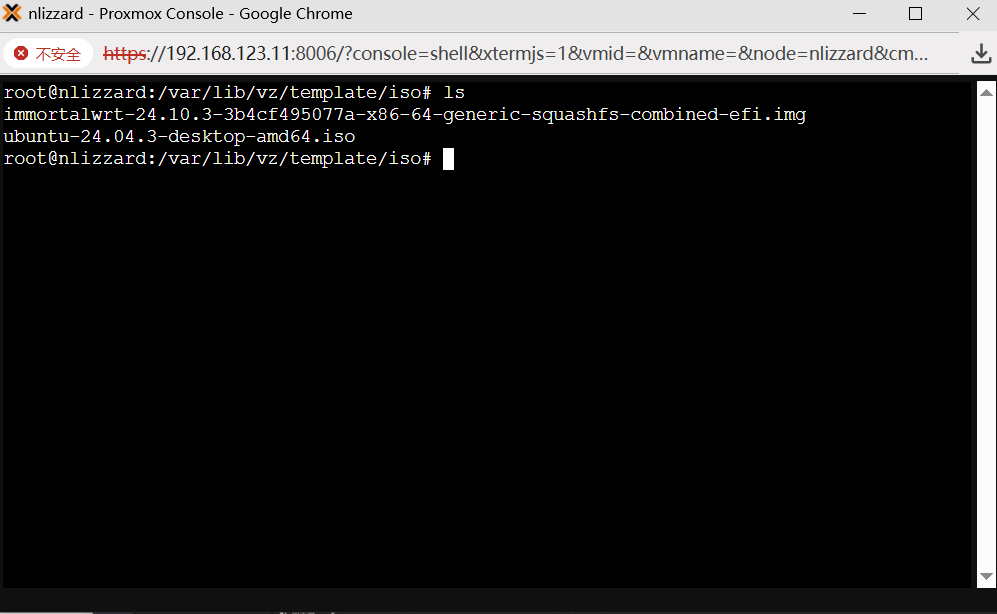

# pve中安装openwrt软路由系统

## 什么是pve？

Proxmox Virtual Environment，是一个开源的服务器虚拟化环境Linux发行版。Proxmox VE基于Debian，使用基于Ubuntu的定制内核，包含安装程序、网页控制台和命令行工具，并且向第三方工具提供了REST API，在Affero通用公共许可证第三版下发行。

## 什么是OpenWrt?

OpenWrt是一个适用于嵌入式设备的Linux发行版。 相对原厂固件而言，OpenWrt不是一个单一、静态的固件，而是提供了一个可添加软件包的可写的文件系统。这让用户可以自由选择应用程序和配置，而不必受设备提供商的限制，并且可以使用一些适合某方面应用的软件包来定制你的设备。

## 如何安装OpenWRT?

1. 首先我们根据自己硬件的版本要下载openwrt的镜像文件
2. 在pve中创建一个没有任何介质的虚拟机
3. 将openwrt的镜像文件上传到pve的local存储区的ISO位置


4. 在pve的shell中使用```qm importdisk <vmid,虚拟机id如100> <镜像文件synoboot.img>  local```的命令，将镜像文件导入到我们创建的虚拟机中，**注意：镜像文件要写对文件路径，local中ISO镜像存储在/var/lib/vz/template/iso/目录下**，示例：

   ```bash
   qm importdisk 100  /var/lib/vz/template/iso/immortalwrt-24.10.3-3b4cf495077a-x86-64-generic-squashfs-combined-efi.img local
   ```



4. 打开虚拟机的界面，点击硬件，把新增加的硬盘添加进虚拟机。随后点击选项，在引导顺序中，把那块新添加的硬盘放到第一位，并且勾选上启动，保存即可。


6. 点击虚拟机中的控制台，启动虚拟机，等到一会儿，系统就成功安装了。
7. 可选：在控制台中输入```vim /etc/config/network```编辑openwrt的ip地址，改为自己喜欢的。然后就可以在浏览器中通过自己设定的ip访问openwrt的管理界面了。


