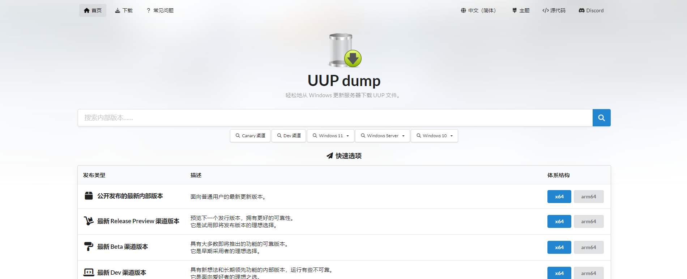

## 起因

​		因为实验室没有给我们新生重新配电脑，给我分配了上一届师兄用的电脑。而师兄在离开学校之前，将电脑进行了格式化，重新安装了win11系统。我拿到电脑后，装了一些必要软件啥的，在我使用scoop安装pnpm的时候，windows安全中心报错了，它怀疑pnpm存在病毒和漏洞，阻止了我的本次安装。毫无疑问，这肯定是误判！！当我想进入windows安全中心使它许可我的安装操作的时候，发现我进入的windows安全中心是一个白板界面，并且提示“你的IT管理员已限制对此应用的某些区域的访问，并且你尝试访问的项目不可用。有关详细信息，请与I支持人员联系”，如图所示。

​		后面就是痛苦的找解决方案的时间。我翻阅了巨多资料，尝试了命令行指令、修改注册表、修改电脑登录账号权限等等都没有解决这个问题。最后我找到了一个方法，它通过重新安装windows安全中心，解决了windows安全中心无法进入的问题。

## 解决方法

1. 进入<a href="https://uupdump.net">windows组件下载网站</a>，如下图所示。

   

2. 查看自己的系统的重要参数，下图中圈起来的部分。

   

3. 在<a href="https://uupdump.net">windows组件下载网站</a>中<strong>(注意，这里以我的系统举例，读者按照自己的电脑参数进行操作)</strong>,先选择版本号信息23H2，如图1；再选择操作系统版本，如图2。

   

   

4. 在搜索框中查找"Microsoft.SecHealthUI_8wekyb3d8bbwe.appx"组件，进行下载。下载完成后，给文件增加后缀".appx"，然后进行安装。安装时，会显示此电脑已安装了windows安全中心，不管，咱点击重新安装。

   

5. 安装完成后，恭喜你，此时你再次进入windows安全中心时，不会出现白板问题，顺利进入！！

6. *如果这个方法没有解决你的问题，你可以去网上尝试其他方法.......*

## 总结

​		我第一次重装win11系统，出现这么bug真是折腾人。网上的教程也是五花八门，各种各样的都有，我也是倒霉，基本把网上的方法都试了个遍，最后快要放弃了，才找到这么个办法。头晕。。。。
