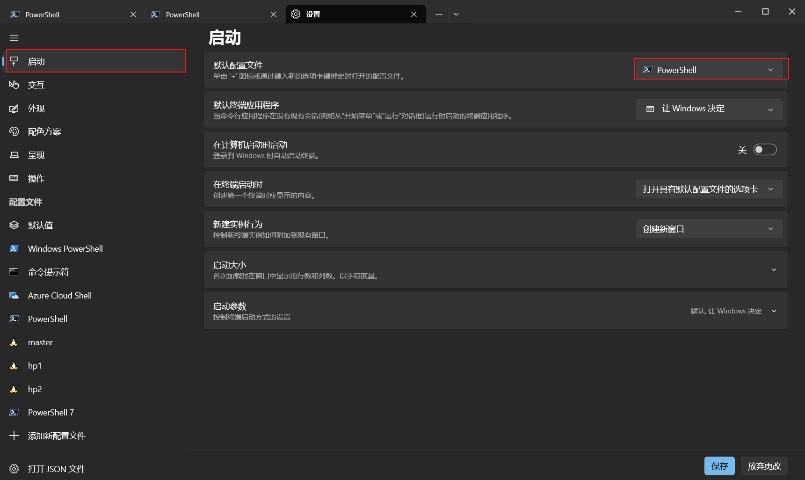
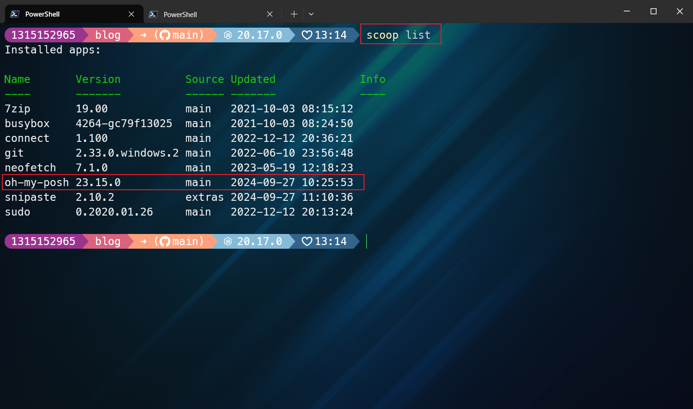
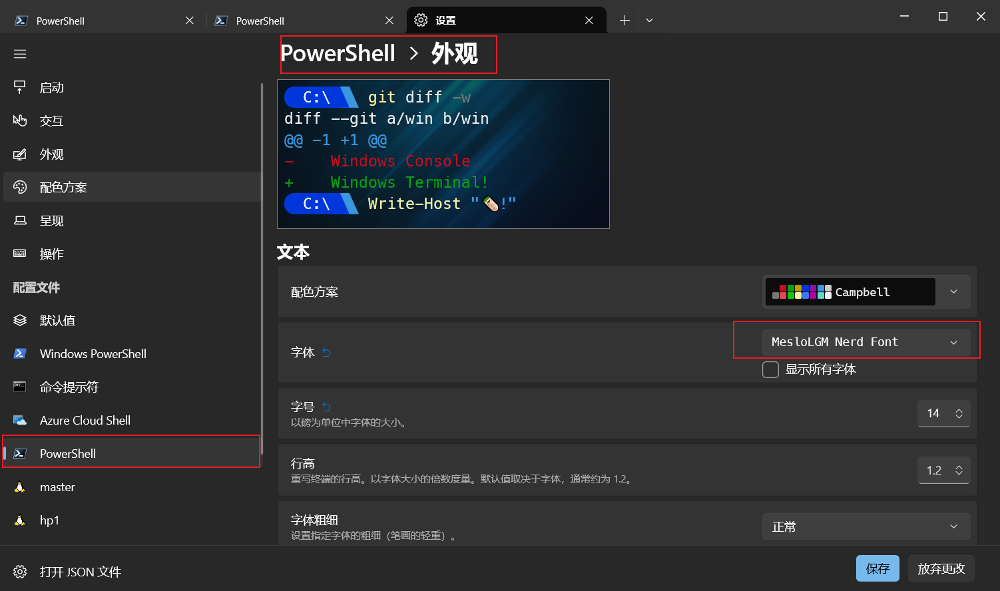
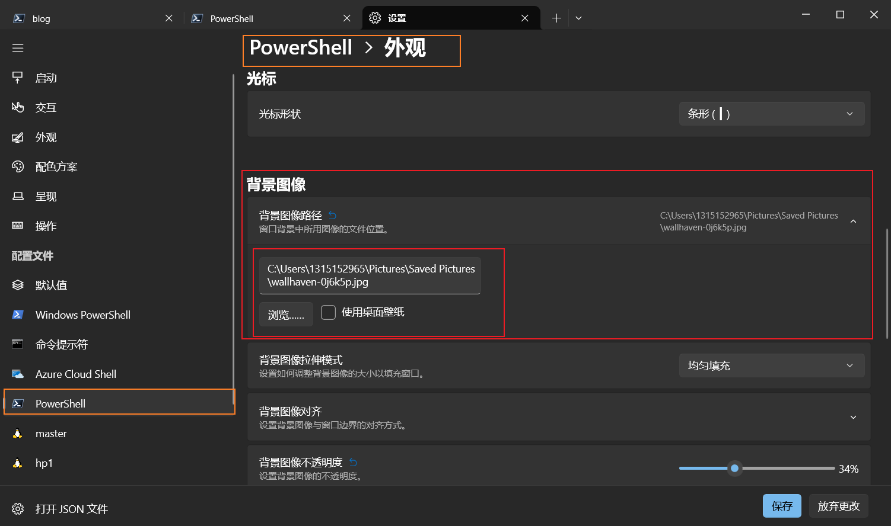
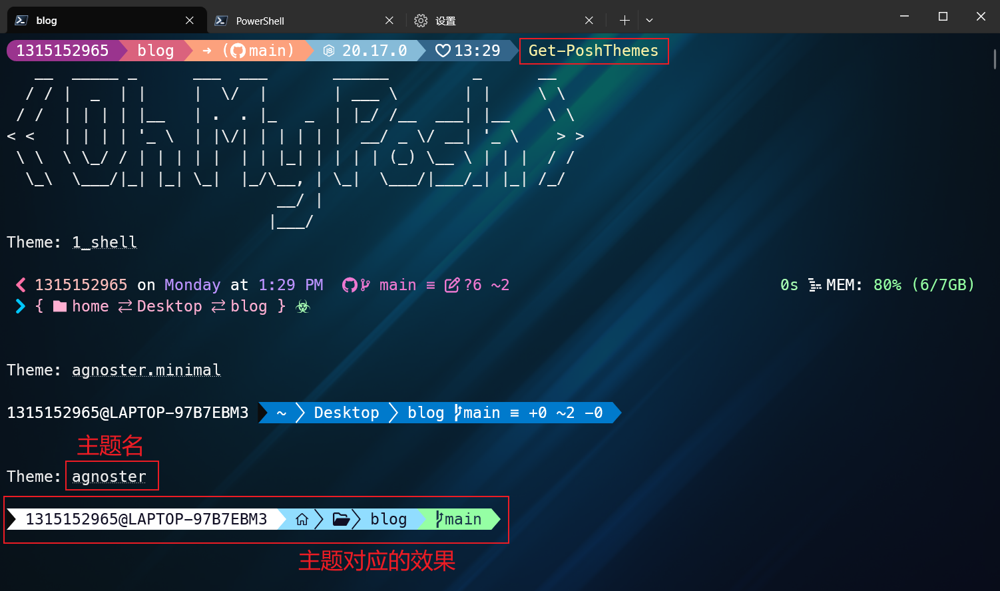
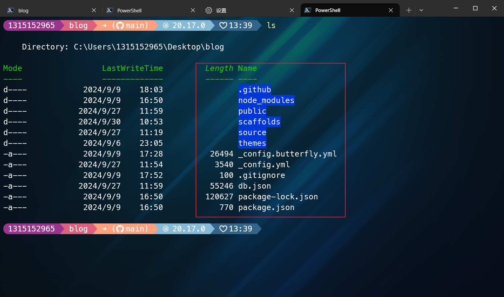
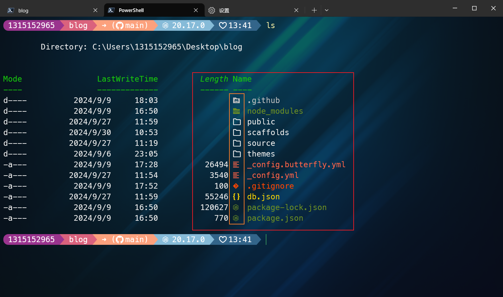
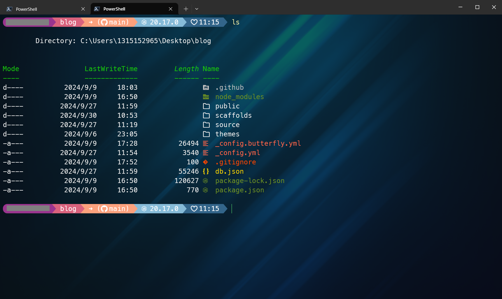

> <strong style="color: orange;font-size:20px">此博客介绍的是windows下终端美化的方法！！</strong>

## 引言

---

​       我在使用终端时，终端单调乏味的界面总是让我感到枯燥乏味，提不起兴致。每次打开终端，面对的是一成不变的黑白配色、简单的命令提示符，长期使用下来难免让人产生视觉疲劳。而且，默认的提示符通常只提供最基础的信息，无法直观地呈现我们开发或工作的环境状态。这时候，一款能够美化终端、提升工作效率的工具显得尤为重要，在我在网上查找资料后发现 Oh-My-Posh 正是这样一款令人惊艳的终端美化工具。它不仅能赋予终端更多的色彩和个性化配置，还能让我们在编码、管理系统时更加得心应手。

​		这篇博客主要讲述了如何使用Oh-My-posh对Powershell进行简单的美化，分为以下几个步骤：

> 1. 下载PowerShell和windowsTerminal
> 2. 下载Oh-My-Posh及必要的字体Meslo
> 3. 修改PowerShell配置文件和WindowsTerminal配置项
> 4. 如何查看和切换Oh-My-Posh的主题
> 5. 下载文件目录图标库（Terminal-Icons）
> 6. 效果展示

## 美化步骤

---

### 1. 下载PowerShell和windowsTerminal

打开微软软件商店（Microsoft Store），下载和安装PowerShell和WindowsTerminal。如果本地这两个软件了，那就更新到最新版。

下载完成后，打开WindowsTerminal，进入设置页，将启动的默认配置文件改为PowerShell，如图所示：

> <strong style="font-size: 20px;color:skyblue">改完别忘了点保存！！</strong>

### 2. 下载Oh-My-Posh及必要的字体Meslo

> <a href="https://ohmyposh.dev/">Oh-My-Posh</a>官网提供了四种安装方法，分别是winget，scoop，manual，chocolatey。可以根据自己的喜好使用对应的工具进行安装。这里附上指引安装的<a href="https://ohmyposh.dev/docs/installation/windows">官网链接</a>
>
> <strong style="color:orange;font-size:18px">这一步我演示的是scoop安装过程，如果使用其他方法可以参照官网安装教程</strong>

#### 使用scoop安装Oh-My-Posh，只需在PowerShell中敲下以下指令即可。

`` scoop install https://github.com/JanDeDobbeleer/oh-my-posh/releases/latest/download/oh-my-posh.json``

> 注意：安装过程如果出现网络问题，多半是被墙了。建议配置终端代理，在命令行中分别敲下以下两行代码（<strong style="color:orange">这种方式只对当前终端有效</strong>）：
>
> ``  $env:HTTP_PROXY="http://127.0.0.1:（填写你自己代理的端口号）" ``
>
> ``  $env:HTTPS_PROXY="http://127.0.0.1:（填写你自己代理的端口号）"``

安装完成后，可以在PowerShell中敲下以下指令，查看是否安装成功：

`` scoop list``

敲完后如果有Oh-My-Posh包，则表示安装成功。

#### 安装官方推荐字体Meslo字体

在PowerShell中敲下下面这条命令即可。（注意：同样需要打开代理，否则可能出现网络超时问题）

`` oh-my-posh font install meslo``

安装完成后，进入下一步。

### 3. 修改PowerShell配置文件和WindowsTerminal配置项

打开WindowsTerminal的设置页，修改PowerShell的字体为MesloLGM Nerd Font。

完成后，去修改PowerShell的配置文件。在PowerShell中敲下`` $profile``,查看PowerShell的配置文件所在位置。随后打开配置文件写入下面这条代码：

`` oh-my-posh init pwsh --config "$env:POSH_THEMES_PATH\M365Princess.omp.json" | Invoke-Expression``

然后保存。

关闭PowerShell，重新打开一个PowerShell终端，你就会发现Oh-my-Posh发挥作用了！

> 为了PowerShell更加好看，咱们也可以为PowerShell增加一张背景图。

### 4. 如何查看和切换Oh-My-Posh的主题

> Oh-My-Posh内置了很多主题，我们可以查看这些主题，然后选一个自己喜欢的，进行使用。

下面这条指令可以查看Oh-My-Posh所有的主题效果

`` Get-PoshThemes``

切换主题也很简单，只需要回到刚才我们刚才修改的PowerShell配置文件中，主题名进行修改就行(M365Princess-->agnoster)，例如：

`` oh-my-posh init pwsh --config "$env:POSH_THEMES_PATH\M365Princess.omp.json" | Invoke-Expression``

改成---->

``  oh-my-posh init pwsh --config "$env:POSH_THEMES_PATH\agnoster.omp.json" | Invoke-Expression``

---

> 到这里Oh-My-Posh的基础美化已经成功了！！但是为了我们的终端更加好看，我们可以在安装一下Terminal-Icons，这个包的作用是让我们的文件和目录前面有一个好看的小图标。

### 下载文件目录图标库（Terminal-Icons）

下载前（文件和目录前面没有图标，啥都没有）：

下载后：

ok，废话不多说，在PowerShell中敲下以下指令即可进行安装。

`` Install-Module -Name Terminal-Icons -Repository PSGallery`` 

安装完成后，进入我们前面修改过的PowerShell配置文件，另起一行，写入以下代码：

`` Import-Module -Name Terminal-Icons``

保存文件，关闭PowerShell，另开一个，这是你就会发现，文件目录的小图标出现了。

> <strong style="color:skyBlue;font-size:18px">至此，咱们的终端美化算是完结撒花了，当然还有一些别的玩法，读者可以自行去学习~</strong>

### 6. 效果展示

最终效果展示如下：

## 总结

---

以前在宿舍看过一个大佬的终端，觉得好酷好炫，但是一直没有仔细去研究，最近实验室没有安排工作，闲下来去研究了一个，发现挺有意思的，终端弄好看了，确实每次打开它，看到里面丰富的配色，心情莫名的好，VeryCool~~

**如果想在VsCode使用美化后的终端，可以将VsCode默认打开终端修改为PowerShell，然后配置一下字体即可。**

> <strong style="color:orange;font-size:20px">VsCode中需要修改终端的字体为MesloLGM Nerd Font，这样VsCode中的终端样式就能正确显示了</strong>

> <strong style="color:red;font-size:15px">注意：美化后，终端打开的速度会变慢一点，因为每次打开时，要读取配置文件。</strong>
